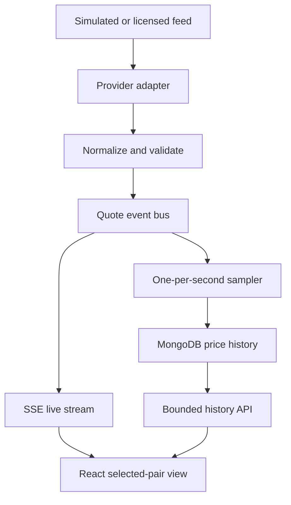

# G10 FX live pricing application: architecture and implementation playbook

**Status:** implementation design; follow the gates in order. **Stack:** Node.js, TypeScript, Express, MongoDB, React, TypeScript, Vite. **Initial feed:** deterministic simulator behind a provider interface. **Live feed:** selected and licensed later. **History policy:** at most one quote per pair per UTC second. **UI:** bid, ask, mid, source time, freshness, and live changes.

## 0. Decisions, scope, and meaning of “complete”

The ten currencies are USD, EUR, GBP, JPY, CHF, CAD, AUD, NZD, SEK, and NOK. Generate 45 unordered combinations (`10 × 9 / 2`), assigning each one a configurable canonical quote direction. The canonical list is a configuration decision, not a claim that every provider streams every cross directly. Reverse views are calculated from a direct quote: reverse bid = `1 / direct ask`, reverse ask = `1 / direct bid`, reverse mid = `(reverse bid + reverse ask) / 2`. Label reverse views `derived`; never present them as independent market quotes. If a vendor lacks a direct cross, an explicitly enabled triangulation adapter may be added later, with provenance and timestamp rules. Never quietly substitute a derived rate.

A *quote* is a provider observation, not an executable trading price. “Real time” means event-driven display of each accepted provider update with measured delay, subject to the provider's feed, network, and browser health. It does not guarantee a change every second, uninterrupted markets, or universal 45-cross coverage. Market data can be decentralized and vendor-specific; the provider's access, redistribution, retention, and historical licensing must be approved before production use.

For the initial build, the simulated feed proves the entire application flow. **Do not mark production-live complete until a named provider, coverage, contract, and entitlement pass Phase 10.** No resume processing, skills extraction, LLM parsing, embeddings, or vector database is needed for numeric FX quotes. A future retrieval/reporting module fits under `modules/retrieval` without changes to ingestion; its implementation is outside this document.

**First-build assumptions to confirm before production:** history retention is configurable (example: 12 months, no automatic deletion until policy is approved); no login or trade execution in this scope; browsers use server-sent events (SSE) because quote delivery is one-way; history uses UTC half-open ranges `[from, to)`; the UI can show the selected pair and a reporting table. Protect production endpoints with your chosen auth and access policy before public exposure.

## 1. Target architecture and contracts



Use an in-process bus for one backend instance in development. For multiple instances, put a durable/shared message layer between ingestion workers and API nodes, or route all browser streams through the worker; do not assume an in-memory bus broadcasts across processes. The persisted history and live stream have different rates: **stream every accepted feed update; store at most one accepted observation per pair per second.** A history read is an explicitly scoped reporting endpoint, not the future retrieval pipeline.

Canonical TypeScript contracts in `packages/shared/src/quote.ts`:

```ts
export type Currency = 'USD'|'EUR'|'GBP'|'JPY'|'CHF'|'CAD'|'AUD'|'NZD'|'SEK'|'NOK';
export type Quote = {
  pair: string; base: Currency; counter: Currency;
  bid: string; ask: string; mid: string; // decimal strings; preserve source precision
  pipSize: '0.01'|'0.0001'; source: string; sourceTimestamp: string;
  receivedAt: string; sequence?: string; derived: boolean;
};
export interface MarketDataProvider {
  connect(): Promise<void>;
  subscribe(pairs: readonly string[], onQuote: (raw: unknown) => void): Promise<void>;
  health(): { connected: boolean; lastMessageAt?: string; detail?: string };
  close(): Promise<void>;
}
```

All timestamps are ISO 8601 UTC; store them as BSON Dates in MongoDB. Use a decimal arithmetic library at boundaries (`decimal.js` is an example) and BSON Decimal128 for stored prices; serialize decimals as strings in JSON. Avoid JavaScript binary floating point for spread, mid, inversion, and pip math. Preserve original provider values and precision rather than rounding source data to pip size.

**Pip rule:** for pairs with JPY as the **counter** currency, use `0.01`; for other canonical quote directions, use `0.0001` as the usual display/pip convention. A JPY base with a non-JPY counter follows the counter's quote convention. Provider-specific tick size, fractional pips, and actual supported precision are configured per pair. Check that values parse as positive decimals, `ask >= bid`, finite spread in configured limits, supported pair, valid source timestamp, and acceptable clock skew. Do **not** reject a valid five-decimal quote merely because a pip is four decimals. Large jumps are alerts/quarantine candidates with provider-specific thresholds, not universal “market-standard” hard failures. Pips moved = decimal price difference divided by configured pip size.

## 2. Repository layout

```text
fx-g10/
  apps/
    api/
      src/
        app.ts                    # Express construction, routes, middleware
        server.ts                 # startup and graceful shutdown
        config/env.ts             # validated environment
        modules/
          market-data/
            domain/{pairs,quote,validation,inversion}.ts
            providers/{provider,simulated,live-template}.ts
            services/{ingest,latest,stream,sampler}.ts
            repositories/{history,latest-state}.ts
            routes/{pairs,quotes,stream,history,health}.ts
          retrieval/README.md    # future module boundary only
        infra/{mongo,logger,errors}.ts
      test/{unit,integration,fixtures}/
      Dockerfile
    web/
      src/{api,components,hooks,pages,types}/
      .env.example
  packages/shared/src/{quote,pairs,api}.ts
  scripts/{seed-pairs,check-ingestion}.ts
  docs/{provider-checklist,runbook}.md
  compose.yaml
  .env.example
  package.json
  tsconfig.base.json
```

Keep vendor payload parsing only in `providers`, transport only in `routes`, business checks in `domain`, writes in `repositories`, and pipeline coordination in `services`. The future `retrieval` module can depend on shared domain contracts and the history repository interface; ingestion must not import retrieval.

## 3. Phase 1 — Bootstrap and configuration

**Build/why:** reproducible monorepo and safe settings before any feed or database work.

**Files:** root `package.json`, workspace configuration, `tsconfig.base.json`, `.gitignore`, `.env.example`; `apps/api/package.json`, `apps/api/src/config/env.ts`; `apps/web/package.json`; `packages/shared/package.json`. Use a current supported Node LTS and lock dependency versions in the lockfile. Commands below assume npm workspaces; adjust the root scripts if you choose another package manager.

**Logic:** define `PORT=3000`, `MONGODB_URI`, `MONGODB_DB=fx_g10`, `FEED_MODE=simulated`, `ALLOWED_ORIGIN=http://localhost:5173`, `QUOTE_STALE_MS`, `MAX_HISTORY_DAYS`, `MAX_HISTORY_POINTS`, `SAMPLE_INTERVAL_MS=1000`, `LOG_LEVEL`, and optional `HISTORY_RETENTION_SECONDS`. Validate types, positive ranges, and required values at startup. Commit examples, never secrets. Reject `FEED_MODE=live` without provider configuration.

**API:** none. **Run/test:** `npm install`, `npm run typecheck`, `npm run lint`; start with a missing required setting and confirm a clear failure. **Gate:** fresh clone installs and checks pass, sample environment explains every variable. **Failures:** malformed URI, invalid port/interval, secret in source control, unsupported Node version.

## 4. Phase 2 — Express process and operational health

**Build/why:** a working HTTP shell with predictable errors and lifecycle.

**Files:** `apps/api/src/{app,server}.ts`, `infra/{logger,errors}.ts`, `modules/market-data/routes/health.ts`.

**Logic:** JSON middleware, explicit CORS origin, request IDs, structured logs with redacted credentials, centralized error mapping, 404 handler, graceful SIGTERM/SIGINT shutdown. Separate process liveness from dependency readiness.

**API:** `GET /health/live → 200`; `GET /health/ready → 503` until MongoDB and required ingestion dependencies are ready, then `200` with feed status and last quote age. No quote data is implied by liveness.

**Run/test:** `npm run dev -w apps/api`; `curl -i localhost:3000/health/live`; confirm unknown path returns JSON 404 and malformed JSON returns JSON 400. **Gate:** health and error cases pass without MongoDB. **Failures:** port occupied, unhandled promise, failed shutdown, leaking stack traces.

## 5. Phase 3 — MongoDB connection and schema

**Build/why:** durable history and queryable time windows. Start MongoDB locally through `compose.yaml` or use a managed deployment; pin a tested MongoDB version.

**Files:** `infra/mongo.ts`, `modules/market-data/repositories/{history,latest-state}.ts`, `scripts/seed-pairs.ts`, `compose.yaml`.

**Logic:** connect with bounded retries, fail readiness on disconnect, close on shutdown. Create `price_history` as a **time-series collection** with `timeField: 'sampledAt'`, `metaField: 'meta'`, and seconds-oriented granularity after checking the deployed version's behavior. `meta` contains stable `{pair, source}`; do not put a changing timestamp in metadata. Add an index supporting `meta.pair + sampledAt`; inspect actual explain plans for the target query. Keep `latest_quotes` as a normal collection keyed by canonical pair for a warm startup and `sample_slots` as a normal collection with unique `{pair, source, secondUtc}` for strict one-per-second coordination. A time-series collection has write/index limitations; do not rely on an upsert or unique index directly on `price_history`. For a single worker, maintain the slot in memory and append one record per second; for retry/multi-worker correctness, atomically claim the unique slot in `sample_slots` before insertion and reconcile claimed slots without history records after crashes. Define retention only after the required history period is approved; MongoDB TTL deletion is asynchronous.

**History document:** `{meta:{pair,source}, sampledAt:Date, sourceTimestamp:Date, receivedAt:Date, bid:Decimal128, ask:Decimal128, mid:Decimal128, pipSize:string, sequence?:string, quality:'valid'}`. Carry an explicit `sampleSecondUtc` if useful. No generated inverse history unless separately required.

**API:** readiness now checks database. **Run/test:** `docker compose up -d mongo`, start API, inspect collection types/indexes and disconnect MongoDB deliberately. **Gate:** process reconnect policy and 503 readiness are observed; one manually inserted sample can be queried by pair and UTC range. **Failures:** invalid credentials, absent collection, index migration conflict, storage quota, DB disconnect. Never silently treat missing writes as success.

## 6. Phase 4 — Pair catalogue and quote validation

**Build/why:** a single source of truth for all 45 crosses, canonical directions, precision rules, and vendor mapping.

**Files:** `packages/shared/src/pairs.ts`, `domain/{pairs,quote,validation,inversion}.ts`, `routes/pairs.ts`, `test/unit/{pairs,validation,inversion}.test.ts`.

**Logic:** generate all distinct unordered combinations and assert count 45 and no duplicates. Maintain a reviewed canonical-direction table and `providerSymbol` mapping separately. Parse `EUR/USD`, `EURUSD`, or explicit base/counter safely; reject unknown codes and identical currencies. `GET /api/v1/pairs` includes `pair`, `base`, `counter`, `pipSize`, `providerStatus` (`simulated`, `direct`, `derived`, `unavailable`) and direction. Normalize source timestamps; handle missing timestamp by explicit vendor policy, not fabricated market time. Validate bid/ask and calculate mid. For inverse views preserve bid/ask side swapping and mark derivation.

**API:** `GET /api/v1/pairs`; unsupported pair returns 400 on quote endpoints. **Run/test:** `npm test -w apps/api -- pairs validation inversion`; `curl localhost:3000/api/v1/pairs`. **Gate:** exactly 45 canonical crosses; representative JPY-counter, non-JPY, inverse and fractional-pip tests pass. **Failures:** inverted spread, zero rate, excessive precision assumption, malformed symbol, stale/future source time, duplicate pair direction.

## 7. Phase 5 — Simulated provider and ingestion normalization

**Build/why:** exercise event-driven ingestion before committing to a vendor.

**Files:** `providers/{provider,simulated}.ts`, `services/{ingest,latest}.ts`, `test/fixtures/quotes.ts`, `test/integration/simulated-ingestion.test.ts`.

**Logic:** seeded deterministic simulator emits plausible bid/ask for each pair at configurable intervals; optional scripted scenarios emit unchanged quotes, jumps, out-of-order messages, disconnects, and malformed messages. Ingestion converts raw messages to `Quote`, validates, checks source/sequence ordering per pair, updates latest cache, publishes accepted events, and emits metrics for rejected/late events. Use source timestamp and sequence if provided; define equal-time tie policy. Never pretend simulator output is live market data. Reconnect with exponential backoff and jitter; resubscribe; mark stale until fresh events arrive.

**API:** `GET /api/v1/quotes/latest?pair=EURUSD` returns quote plus freshness/status; `404` if no quote, `400` if bad pair. **Run/test:** `FEED_MODE=simulated npm run dev -w apps/api`, call latest twice and confirm source/timestamps update; inject malformed fixture. **Gate:** accepted quotes reach latest state and invalid quotes do not. **Failures:** feed disconnect, repeated sequence, out-of-order timestamps, gaps, impossible spread, clock skew.

## 8. Phase 6 — Store one sample per pair per second

**Build/why:** bound storage while retaining a predictable reporting series.

**Files:** `services/sampler.ts`, `repositories/history.ts`, `test/integration/sampling.test.ts`, `scripts/check-ingestion.ts`.

**Logic:** for each pair and UTC second, choose the **last accepted quote received in that second** (or document a different deterministic choice). At second rollover, flush the prior slot; a quote arriving late must not rewrite the previously committed second. If no quote arrives, store no sample and leave a gap; do not invent flat prices. Batch writes, cap queue size, expose backlog metrics, apply bounded retries. Acknowledge persisted status only after MongoDB confirms a write. The sample-slot claim plus reconciliation job prevents duplicate claims but needs crash-safe handling: reconciliation compares claimed slots to history and inserts missing documents from a stored payload, then marks complete. For an initial single-instance development build, a simpler append-and-audit implementation is acceptable, with duplicate audit and no exactly-once claim.

**API:** no new endpoint. **Run/test:** inject three updates in one second and one in the next; query MongoDB and verify two samples with the expected final values; restart during a pending flush. **Gate:** one-per-second behavior, gaps, retries, and restart behavior match the chosen guarantee; no success log for a failed write. **Failures:** duplicate insert after restart, backpressure, partial batch success, crash between slot claim and append, DB outage. Quantify storage before production: 45 pairs × 86,400 seconds = **3,888,000 possible samples/day**, or roughly **116.6 million per 30 days** if each pair updates every second. Actual count depends on feed cadence and gaps; capacity test and retention decision are mandatory.

## 9. Phase 7 — Live delivery API and frontend dashboard

**Build/why:** display each accepted change promptly; browser never talks directly to the market feed.

**Files:** `routes/stream.ts`, `services/stream.ts`; `apps/web/src/api/client.ts`, `hooks/useQuoteStream.ts`, `components/{PairSelector,QuoteCard,ConnectionBadge}.tsx`, `pages/Dashboard.tsx`, `apps/web/.env.example`.

**Logic:** `GET /api/v1/quotes/stream?pair=EURUSD` serves `text/event-stream`; send initial latest quote, subsequent accepted quote events, heartbeat comments, and connection status. Clean up listeners on disconnect and pair changes. Browser `EventSource` reconnects; on reconnect fetch latest again rather than claiming missed updates were replayed unless a bounded replay log is built. Include event ID only with a truthful replay policy. UI shows bid, ask, mid, movement in pips from previous accepted quote, source time, connection state, freshness, `simulated/live/derived` label, and explicit unavailable/stale states. Retain decimal strings for rendering; don't silently round prices to whole pips. For cross-origin development configure Vite proxy or Express CORS deliberately.

**API:** stream endpoint plus latest endpoint. **Run/test:** `npm run dev -w apps/web`, select two pairs, watch several events, stop/restart API, change selection, inspect network listeners. **Gate:** displayed update follows accepted feed event, no duplicate streams after pair switch, stale badge appears after threshold, reconnect fetches latest. **Failures:** proxy buffering, disconnected browser, SSE heartbeat timeout, unauthorized origin, slow client, no latest quote. Limit clients and use auth appropriate to deployment.

## 10. Phase 8 — Historical reporting API and UI

**Build/why:** retrieve stored prices over weeks/months without implementing a separate retrieval pipeline.

**Files:** `routes/history.ts`, `repositories/history.ts`, `apps/web/src/components/HistoryTable.tsx`, `apps/web/src/pages/History.tsx`, integration tests.

**Logic:** `GET /api/v1/quotes/history?pair=EURUSD&from=2026-01-01T00:00:00Z&to=2026-02-01T00:00:00Z&limit=1000&cursor=...`; validate pair, UTC instants, `from < to`, maximum range and page size; query `{ 'meta.pair': pair, sampledAt: {$gte: from, $lt: to} }` in stable `(sampledAt, _id)` order with opaque keyset cursor and explicit source filtering when multiple sources exist. If time-series `_id` or chosen indexing complicates stable pagination, use a stable persisted sample key in a normal reporting collection or timestamp plus deterministic tie-breaker; test the actual deployed version. Return decimal strings, UTC timestamps, `nextCursor`, `source`, and whether gaps exist. Never send months of second-level ticks to the browser in one response. For long-range reports offer server-side minute/hour aggregates or bounded CSV export as a later enhancement, while retaining raw samples according to policy. The UI supports date range, paged rows, loading/error/empty states, and controlled limits.

**API:** history endpoint; `400` invalid ranges, `413`/`422` excessive request, `503` unavailable database. **Run/test:** seed known samples on both sides of range boundaries; request several pages and compare against a direct MongoDB query. **Gate:** UTC interval boundaries, source filter, stable pagination, precision and page caps pass; query plan and latency are acceptable at realistic volume. **Failures:** unbounded scans, ambiguous timezone, dropped page rows, expired retention, partial data gaps, invalid cursors.

## 11. Phase 9 — Reliability, observability, and deployment rehearsal

**Build/why:** make outages and silent data loss visible before live feed cutover.

**Files:** `infra/logger.ts`, `docs/runbook.md`, alert/config files for deployment, integration tests.

**Logic:** structured logs with request ID, pair, source, and failure stage, excluding credentials and raw sensitive payloads. Metrics: feed connected, last accepted quote age per pair, invalid/out-of-order counts, SSE clients/disconnects, sampler queue depth, write failures/retries, expected-vs-actual sampled slots, history query latency, MongoDB disk use. Alert on stale quotes, sustained DB failures, and backlog. Add graceful drain, bounded shutdown flush, replay/reconciliation plan, rate limits for history, TLS, secret manager, backups, restore test, CI lint/typecheck/unit/integration build, and load tests with 45 streams and realistic client count. Decide retention from measured storage and requirements. Frontend must prominently distinguish simulated, stale, and unavailable prices.

**API:** readiness reports dependency state without secrets. **Run/test:** disable MongoDB; disconnect feed; restart a process; run query and client load rehearsal. **Gate:** failures produce visible state and alerts, no data silently fabricated, backup/restore and resource sizing documented. **Failures:** write queue overflow, loss on restart, too many SSE connections, log storm, disk exhaustion, data leaked through public history API.

## 12. Phase 10 — Licensed live-provider adapter and production gate

**Build/why:** replace the simulator with actual subscribed market data while keeping domain, storage and UI contracts intact.

**Files:** `providers/live-template.ts` becomes `providers/<vendor>.ts`; `docs/provider-checklist.md`; contract fixtures; secure env configuration.

**Provider selection checklist:** named vendor and product/tier; direct streaming transport and heartbeat; all 45 canonical crosses or a documented coverage matrix; bid/ask availability; quote direction; timestamps, ordering/sequence, cadence, precision and trading hours; authentication, reconnect, rate limits; snapshot on reconnect; price storage, retention, analytics, browser redistribution and derived cross permissions; commercial cost; historical/backfill availability. Verify each item against current vendor documentation and agreement. Do not hardcode a vendor or claim entitlements before review.

**Logic:** implement connect/auth/subscribe/normalize/health/close against vendor specification. Map vendor symbols and bid/ask, preserve raw source time, bound clock skew and stale age, resubscribe on reconnect, request a fresh snapshot if supported. For unavailable crosses show unavailable or explicitly derived; never advertise 45 directly streamed pairs if only some are licensed. Provider adapter contract tests use captured permitted fixtures. Use a deployment switch `FEED_MODE=live`; block mixed simulated output in a live environment except an explicitly labeled test environment.

**API:** existing endpoints remain stable; pair metadata now exposes actual coverage and provenance. **Run/test:** sandbox integration, then controlled live subscription; compare raw vendor messages to normalized/latest/history records and frontend display for JPY and non-JPY pairs. **Gate:** written coverage/entitlement signoff, valid bid/ask precision, measured latency and freshness, reconnection, Mongo persistence, history query, and operational alerts all pass. **Failures:** missing permission to store/redistribute, unsupported pair, throttling, feed outage, delayed/non-executable quotes, timestamp drift, symbol inversion.

## 13. End-to-end ingestion verification and exit criteria

Run these gates in sequence; if one fails, fix that phase and rerun dependent checks before proceeding:

1. **Catalogue:** exactly 45 canonical combinations, correct direction/pip metadata; unsupported symbols rejected.
2. **Feed:** simulator emits valid changes; selected quote updates through SSE with source timestamp and freshness.
3. **Quality:** malformed, inverted, stale, and out-of-order quotes are quarantined/logged, not displayed as new live values.
4. **Sampling:** multiple updates within one second yield at most one stored sample; no events yield no fabricated sample.
5. **Persistence:** stored Decimal128 bid/ask/mid and timestamps survive API restart; write failures are observable.
6. **History:** bounded UTC queries return the correct pair, source, time interval and precision across pages; month-scale performance is measured.
7. **Resilience:** feed/browser/database failures surface stale/unavailable status and reconnect without hidden duplicate listeners or unreported data loss.
8. **Live activation:** actual provider coverage and storage/display permissions verified; production switch remains off until Phase 10 passes.

**Final state:** **FX Price Ingestion → Verification → Ingestion Complete → Ready for Retrieval.** “Ready for Retrieval” means the stored history and repository boundary are stable and verified; no separate retrieval or RAG pipeline has been implemented. With the simulator alone, the status is **simulation ingestion complete, live-provider gate pending**.

## References for implementation checks

- [MongoDB time-series collections and limitations](https://www.mongodb.com/docs/manual/core/timeseries-collections/) and [time-series limitations](https://www.mongodb.com/docs/manual/core/timeseries/timeseries-limitations/).
- [MongoDB time-series TTL behavior](https://www.mongodb.com/docs/manual/core/timeseries/timeseries-automatic-removal/) and [time-series indexes](https://www.mongodb.com/docs/manual/core/timeseries/timeseries-index/).
- [MDN server-sent events](https://developer.mozilla.org/en-US/docs/Web/API/Server-sent_events/Using_server-sent_events/).

